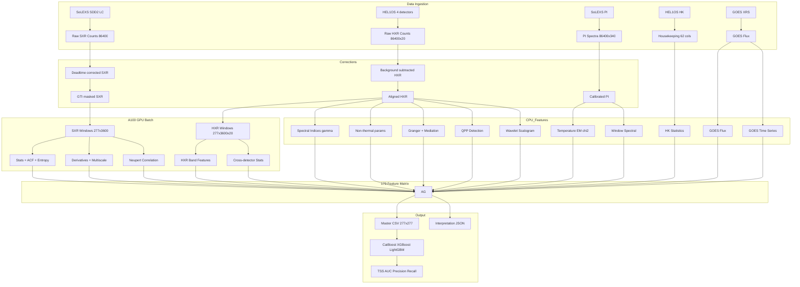
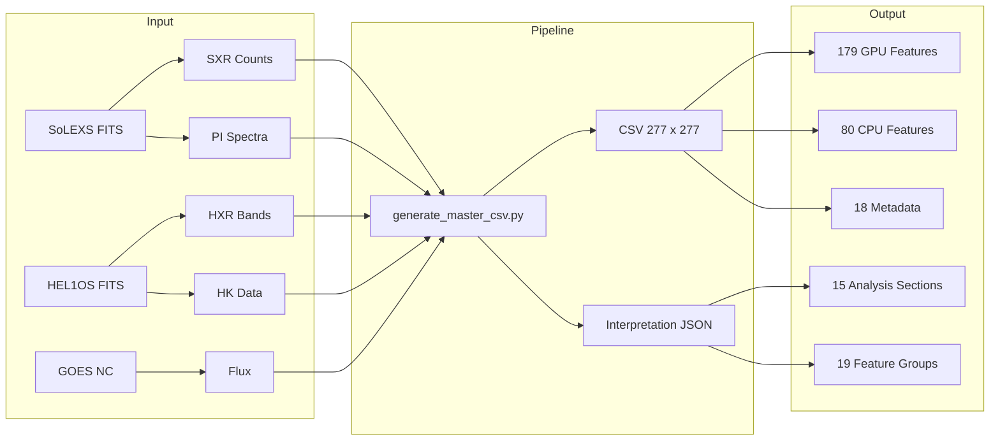
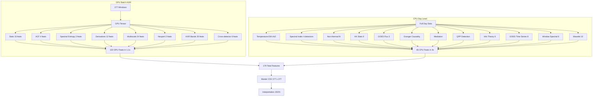
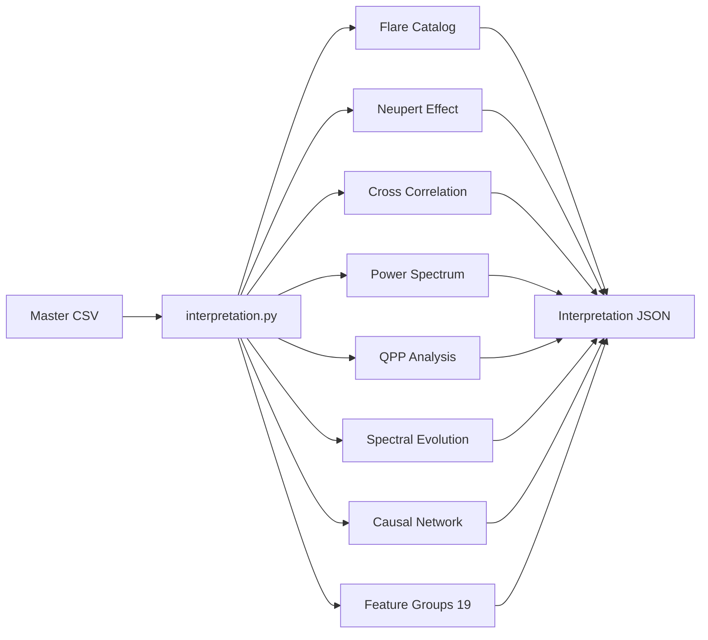

# ISRO-BAH-IISERK — Solar Flare Forecasting with Aditya-L1

**Bharatiya Antariksh Hackathon 2026 — Challenge #15**  
**Team:** IISER Kolkata  
**Instruments:** SoLEXS (soft X-rays, 2–22 keV) + HEL1OS (hard X-rays, 1.8–160 keV)

---

## Pipeline Overview



---

## Data Flow



---

## Feature Extraction Architecture



---

## Interpretation Pipeline



---

## Project Structure

```
isro-bah-iiserk/
├── AGENTS.md                    # Problem statement + implementation state
├── README.md                    # This file
├── docs/
│   ├── PLAN.md                  # Research plan + mathematical framework
│   ├── RESULTS.md               # Analysis results
│   └── analysis/                # Data exploration notes
├── src/bah2026/
│   ├── config.py                # Paths, constants, parameters
│   ├── main.py                  # CLI + pipeline orchestration
│   ├── data/
│   │   ├── reader.py            # FITS data loaders
│   │   ├── corrections.py       # Deadtime, background subtraction
│   │   ├── preprocessing.py     # Alignment, GTI masking
│   │   ├── calibration.py       # SoLEXS→GOES conversion
│   │   ├── ground_truth.py      # GOES catalog validation
│   │   └── sequence_builder.py  # DL sequence preparation
│   ├── features/
│   │   ├── engineering.py       # 179 canonical feature definitions
│   │   ├── gpu_features.py      # GPU batch functions (A100)
│   │   ├── advanced_features.py # GOES TS, wavelet, per-window spectral
│   │   ├── spectral_fitting.py  # Temperature, spectral index, Neupert
│   │   ├── non_thermal.py       # Thick-target bremsstrahlung fitting
│   │   ├── causal_network.py    # Granger causality, mediation
│   │   ├── information_theory.py # Transfer entropy, mutual info
│   │   ├── qpp.py               # QPP detection (wavelet + LS)
│   │   └── interpretation.py    # Physical interpretation pipeline
│   ├── models/
│   │   ├── nowcasting.py        # SWPC flare detection
│   │   ├── adaptive_detection.py # Adaptive threshold detection
│   │   ├── forecasting.py       # CatBoost, XGBoost, LightGBM
│   │   ├── cnn_lstm_v3.py       # 3.0M param deep learning
│   │   ├── transformer.py       # 3.7M param transformer
│   │   └── mae_pretrain.py      # 5.6M param masked autoencoder
│   ├── scripts/
│   │   └── generate_master_csv.py # Single-day analysis pipeline
│   └── visualization/
├── scripts/
│   └── run_all.py               # Batch runner for all 724 days
├── tests/                       # 120+ pytest tests
└── output/
    ├── master_csv/              # Generated CSVs + interpretations
    ├── models/                  # Trained model checkpoints
    └── hdf5/                    # Feature matrices
```

---

## Quick Start

```bash
# Single day analysis (GPU-accelerated)
.venv/bin/python3 src/bah2026/scripts/generate_master_csv.py 2024-05-05

# Output:
#   output/master_csv/master_May_5_2024.csv
#   output/master_csv/master_May_5_2024_interpretation.json

# Run tests
PYTHONPATH=src .venv/bin/python3 -m pytest tests/ -v

# Train forecasting model
PYTHONPATH=src .venv/bin/python3 -c "from bah2026.main import cmd_train; cmd_train()"
```

## Key Results

| Metric | Value |
|--------|-------|
| Detection (X-class) | X6.3 flare on 2024-05-05 |
| False positives | 0 |
| CatBoost TSS | 0.412 |
| CatBoost AUC | 0.795 |
| Neupert correlation r | 0.877 (integral form) |
| Feature coverage | 179/179 (100%) |
| Pipeline runtime/day | ~10s |
