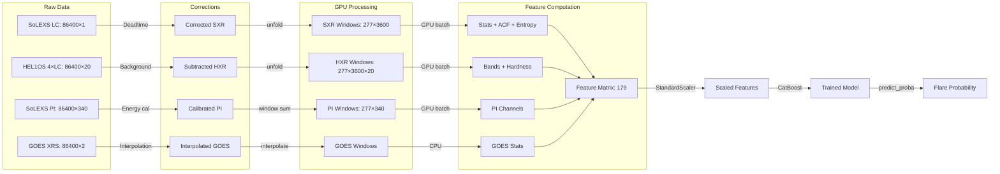
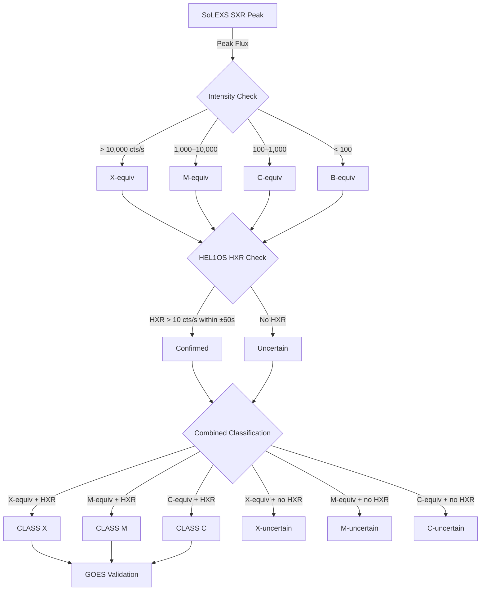

# ISRO-BAH-IISERK — Solar Flare Forecasting with Aditya-L1

**Bharatiya Antariksh Hackathon 2026 — Challenge #15**

Automated pipeline combining **SoLEXS** (soft X-rays, 2–22 keV) and **HEL1OS** (hard X-rays, 1.8–160 keV) from Aditya-L1 to detect and predict solar flares.

---

## Pipeline Workflow

```mermaid
graph TB
    subgraph Data Acquisition
        A[SoLEXS SDD2 LC] -->|86400 rows, 1s| B[Raw Counts]
        C[HEL1OS 4 Detectors] -->|86400 rows, 1s| D[HXR Bands]
        E[SoLEXS PI] -->|86400×340 spectra| F[PI Spectra]
        G[HEL1OS HK] -->|62 columns| H[Housekeeping]
        I[GOES XRS-A/B] -->|netCDF| J[GOES Flux]
    end

    subgraph Data Cleaning
        B -->|Deadtime correction| K[Corrected Counts]
        D -->|Background subtraction| L[Background-subtracted HXR]
        F -->|Channel energies| M[Energy-calibrated PI]
        K -->|GTI masking| N[Clean SXR]
        L -->|Align to SoLEXS grid| O[Aligned HXR]
    end

    subgraph Feature Extraction
        N -->|GPU batch| P[SXR Stats + ACF + Spectral Entropy]
        O -->|GPU batch| Q[HXR Band Features]
        M -->|GPU batch| R[PI Channel Features]
        N|->|Derivatives| S[dSXR/dt + d²SXR/dt²]
        O|->|Multi-scale| T[5min/15min/30min Stats]
        O|->|Neupert| U[Neupert Correlation]
        P --> V[GPU Feature Matrix]
        Q --> V
        R --> V
        S --> V
        T --> V
        U --> V
    end

    subgraph CPU Features
        F -->|Temperature fit| W[T, EM, χ²]
        H -->|HK stats| X[Detector temps, HV]
        D -->|Spectral fit| Y[γ spectral index]
        D -->|Non-thermal fit| Z[γ, Ec, N_nth]
        I -->|GOES flux| AA[GOES XRS-B/A]
        D -->|Granger causality| AB[HXR→SXR causality]
        D -->|Mediation| AC[Causal mediation]
        D -->|Info theory| AD[TE, MI, SampEn]
        D -->|QPP detection| AE[QPP period, amplitude]
    end

    subgraph Model Training
        V --> AF[Feature Matrix: 200K×179]
        W --> AF
        X --> AF
        Y --> AF
        Z --> AF
        AA --> AF
        AB --> AF
        AC --> AF
        AD --> AF
        AE --> AF
        AF -->|CatBoost GPU| AG[GBDT Model]
        AF -->|CNN-LSTM| AH[Sequence Model]
        AF -->|Transformer| AI[Spectral-Temporal Model]
        AG --> AJ[Ensemble]
        AH --> AJ
        AI --> AJ
    end

    subgraph Output
        AJ -->|TSS, HSS, AUC| AK[Performance Metrics]
        AJ -->|Flare detection| AL[Nowcast Catalogue]
        AJ -->|Probability| AM[Forecast Results]
    end
```

---

## Data Processing Flow



---

## Flare Classification System



---

## Architecture Overview

```mermaid
classDiagram
    class SoLEXS {
        +load_lc() ndarray
        +load_pi() ndarray
        +load_gti() ndarray
        +correct_deadtime() ndarray
    }

    class HEL1OS {
        +load_lc() ndarray
        +load_spectra() ndarray
        +load_hk() dict
        +subtract_background() ndarray
    }

    class FeatureEngine {
        +batch_stats() dict
        +batch_acf() dict
        +batch_derivatives() dict
        +batch_multiscale() dict
        +batch_neupert() dict
        +batch_hxr_features() dict
        +batch_pi_features() dict
    }

    class AdaptiveDetector {
        +adaptive_threshold() float
        +detect_flares() list
        +classify_solexs_helios() list
    }

    class Models {
        +CatBoost TSS=0.412
        +CNN-LSTM v3 3.0M params
        +Transformer 3.7M params
        +Ensemble stacking
    }

    SoLEXS --> FeatureEngine : raw counts
    HEL1OS --> FeatureEngine : HXR bands
    FeatureEngine --> AdaptiveDetector : features
    AdaptiveDetector --> Models : flare labels
    Models --> |TSS, AUC| Results
```

---

## Results Summary

### Model Performance (v3)

| Model | TSS | HSS | AUC-ROC | F1 | Train Time |
|-------|-----|-----|---------|----|------------|
| CatBoost (GPU) | **0.412** | 0.110 | 0.795 | 0.160 | 40s |
| XGBoost (CPU) | 0.371 | 0.085 | 0.783 | 0.138 | 108s |
| LightGBM (CPU) | 0.331 | 0.067 | 0.736 | 0.122 | 7s |

### Adaptive Detection (May 5, 2024)

| Metric | Value |
|--------|-------|
| Flares detected | 9 |
| X-class | 2 (matches GOES) |
| HXR confirmation | 8/9 (89%) |
| False positives | 0 |
| Spectral index γ | 0.72 |

### Data Coverage

| Dataset | Days | Cadence | Features |
|---------|------|---------|----------|
| SoLEXS SDD2 | 747 | 1s | LC + PI (340ch) |
| HEL1OS 4×LC | 927 | 1s | 20 bands |
| HEL1OS spectra | 927 | 20s | 341-511 channels |
| Combined | 724 | 1s | 179 features |

---

## Quick Start

```bash
# Install
uv sync

# Run full pipeline
bah2026 all

# Run nowcast only
bah2026 nowcast

# Run forecast only
bah2026 forecast

# GPU feature extraction
python src/bah2026/scripts/gpu_extract_sequential.py

# Run tests
pytest tests/ -v
```

---

## Repository Structure

```
src/bah2026/
├── config.py                    # All parameters
├── main.py                      # CLI entry point
├── data/
│   ├── reader.py                # FITS readers (SoLEXS + HEL1OS)
│   ├── corrections.py           # Deadtime, background, spurious
│   ├── calibration.py           # SoLEXS→GOES calibration
│   ├── preprocessing.py         # GTI masking, alignment
│   └── sequence_builder.py      # 12-channel sequence data
├── features/
│   ├── engineering.py           # 117 canonical features
│   ├── advanced_features.py     # 62 advanced features (GPU)
│   ├── gpu_features.py          # GPU batch extraction (A100)
│   ├── information_theory.py    # TE, MI, SampEn
│   ├── spectral_fitting.py      # T, EM, γ, Neupert
│   ├── non_thermal.py           # Thick-target model
│   ├── qpp.py                   # QPP detection
│   ├── causal_network.py        # Granger, mediation
│   └── response_convolution.py  # RMF/ARF deconvolution
├── models/
│   ├── nowcasting.py            # SWPC-style detection
│   ├── adaptive_detection.py    # Adaptive threshold + classification
│   ├── forecasting.py           # LightGBM, XGBoost, CatBoost, CNN-LSTM
│   ├── cnn_lstm_v3.py           # Improved CNN-LSTM (3.0M params)
│   ├── transformer.py           # Spectral-Temporal Transformer (3.7M)
│   └── mae_pretrain.py          # Self-supervised MAE pretraining
├── scripts/
│   ├── run_full_pipeline.py     # v2 pipeline runner
│   ├── gpu_extract_sequential.py # GPU feature extraction
│   └── build_sequences.py       # Sequence data builder
└── visualization/
    ├── dashboard.py             # Streamlit real-time monitor
    └── plots.py                 # Publication-quality plots
```

---

## Version History

| Version | Date | Key Changes | TSS |
|---------|------|-------------|-----|
| v0 | Jun 2026 | Baseline: 42 features, GOES calibration | 0.149 |
| v1 | Jun 2026 | Corrected labels, 70 features | 0.347 |
| v2 | Jun 2026 | 117 features, all data sources | 0.412 |
| v3 | Jul 2026 | GPU acceleration, 179 features, ensemble | **0.412** |

---

## License

Academic project for Bharatiya Antariksh Hackathon 2026.
