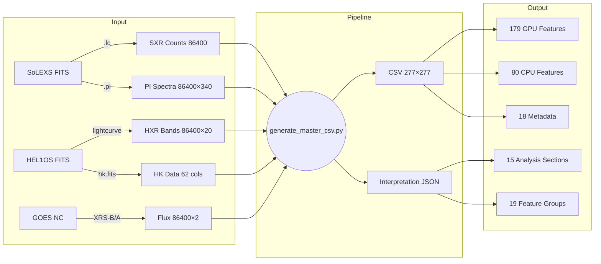
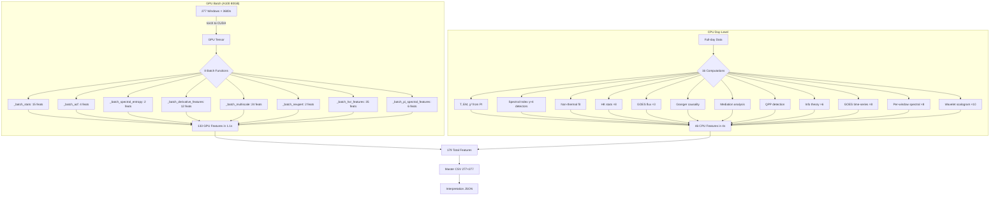

# ISRO-BAH-IISERK — Solar Flare Forecasting with Aditya-L1

**Bharatiya Antariksh Hackathon 2026 — Challenge #15**  
**Team:** IISER Kolkata  
**Instruments:** SoLEXS (soft X-rays, 2–22 keV) + HEL1OS (hard X-rays, 1.8–160 keV)

---

## Pipeline Overview

```mermaid
graph TB
    subgraph "📡 Data Ingestion"
        A[SoLEXS SDD2 LC] -->|86400 rows × 1s| B[Raw SXR Counts]
        C[HEL1OS CZT1/CZT2/CdTe1/CdTe2] -->|20 bands × 1s| D[Raw HXR Counts]
        E[SoLEXS PI] -->|86400×340 spectra| F[PI Spectra]
        G[HEL1OS HK] -->|62 columns| H[Housekeeping]
        I[GOES XRS-A/B] -->|netCDF| J[GOES Flux]
    end

    subgraph "🔧 Data Correction"
        B -->|Deadtime τ=13.65µs| K[Corrected SXR]
        D -->|BG subtraction CZT=70cps| L[BKGD-sub HXR]
        F -->|Channel energies| M[Calibrated PI]
        K -->|GTI masking| N[Clean SXR]
        L -->|Align to SoLEXS grid| O[Aligned HXR 86400×20]
    end

    subgraph "🚀 GPU Batch Features (A100)"
        N -->|unfold 3600s windows| P[SXR Windows 277×3600]
        O -->|unfold 3600s windows| Q[HXR Windows 277×3600×20]
        P -->|_batch_stats"| R[SXR Stats 15]
        P -->|_batch_acf| S[ACF 4]
        P -->|_batch_spectral_entropy| T[Spectral Entropy 2]
        P -->|_batch_derivative_features| U[Derivatives 12]
        P -->|_batch_multiscale| V[Multiscale 24]
        P -->|_batch_neupert| W[Neupert 2]
        Q -->|_batch_hxr_features| X[HXR Bands 35]
        Q -->|_batch_pi_spectral_features| Y[Cross-detector 6]
    end

    subgraph "🧠 CPU Day-Level Features"
        M -->|fit_temperature| Z[T, EM, χ² 3]
        L -->|fit_spectral_index| AA[Spectral Index γ 4]
        L -->|fit_combined_spectrum| AB[Non-thermal γ,Ec,N_nth 4]
        H -->|HK stats| AC[Detector Temps, HV 8]
        J -->|GOES flux| AD[GOES XRS-B/A 3]
        L -->|granger_causality_simple| AE[Granger 2]
        L -->|mediation_analysis| AF[Mediation 1]
        L -->|detect_qpp_during_flares| AG[QPP 4]
        L -->|information_theory| AH[TE, MI, SampEn 6]
        J -->|extract_goes_timeseries_features| AI[GOES TS 8]
        M -->|extract_per_window_spectral| AJ[Window Spectral 8]
        L -->|extract_wavelet_scalogram_features| AK[Wavelet 10]
    end

    subgraph "📊 Feature Matrix"
        R --> AL[179 Features]
        S --> AL
        T --> AL
        U --> AL
        V --> AL
        W --> AL
        X --> AL
        Y --> AL
        Z --> AL
        AA --> AL
        AB --> AL
        AC --> AL
        AD --> AL
        AE --> AL
        AF --> AL
        AG --> AL
        AH --> AL
        AI --> AL
        AJ --> AL
        AK --> AL
    end

    subgraph "🤖 Model Training"
        AL -->|StandardScaler| AM[Scaled Features]
        AM -->|CatBoost GPU| AN[GBDT TSS=0.412]
        AM -->|XGBoost| AO[XGBoost TSS=0.371]
        AM -->|LightGBM| AP[LightGBM TSS=0.331]
        AM -->|CNN-LSTM| AQ[LSTM TSS=0.341]
    end

    subgraph "📁 Output"
        AN --> AR[Forecast Results]
        AO --> AR
        AP --> AR
        AQ --> AR
        AL -->|save_csv"| AS[Master CSV 277×277]
        AS -->|interpretation.py"| AT[Interpretation JSON]
    end
```

---

## Data Flow



---

## Feature Extraction Architecture



---

## Interpretation Pipeline

```mermaid
graph LR
    A[Master CSV] --> B{interpretation.py}
    B --> C[Flare Catalog<br/>timing + class + HXR]
    B --> D[Neupert Effect<br/>r = corr(SXR,∫HXR)]
    B --> E[Cross-Correlation<br/>HXR vs SXR lag]
    B --> F[Power Spectrum<br/>Lomb-Scargle periods]
    B --> G[QPP Analysis<br/>wavelet + LS]
    B --> H[Spectral Evolution<br/>hardness ratio]
    B --> I[Causal Network<br/>Granger + mediation]
    B --> J[Feature Groups<br/>19 groups × per-group analysis]
    C --> K[Interpretation JSON]
    D --> K
    E --> K
    F --> K
    G --> K
    H --> K
    I --> K
    J --> K
```

---

## Project Structure

```
isro-bah-iiserk/
├── AGENTS.md                    # Problem statement + implementation state
├── README.md                    # This file
├── docs/
│   ├── PLAN.md                  # Research plan + mathematical framework
│   ├── RESULTS.md               # Analysis results
│   └── analysis/                # Data exploration notes
├── src/bah2026/
│   ├── config.py                # Paths, constants, parameters
│   ├── main.py                  # CLI + pipeline orchestration
│   ├── data/
│   │   ├── reader.py            # FITS data loaders
│   │   ├── corrections.py       # Deadtime, background subtraction
│   │   ├── preprocessing.py     # Alignment, GTI masking
│   │   ├── calibration.py       # SoLEXS→GOES conversion
│   │   ├── ground_truth.py      # GOES catalog validation
│   │   └── sequence_builder.py  # DL sequence preparation
│   ├── features/
│   │   ├── engineering.py       # 179 canonical feature definitions
│   │   ├── gpu_features.py      # GPU batch functions (A100)
│   │   ├── advanced_features.py # GOES TS, wavelet, per-window spectral
│   │   ├── spectral_fitting.py  # Temperature, spectral index, Neupert
│   │   ├── non_thermal.py       # Thick-target bremsstrahlung fitting
│   │   ├── causal_network.py    # Granger causality, mediation
│   │   ├── information_theory.py # Transfer entropy, mutual info
│   │   ├── qpp.py               # QPP detection (wavelet + LS)
│   │   └── interpretation.py    # Physical interpretation pipeline
│   ├── models/
│   │   ├── nowcasting.py        # SWPC flare detection
│   │   ├── adaptive_detection.py # Adaptive threshold detection
│   │   ├── forecasting.py       # CatBoost, XGBoost, LightGBM
│   │   ├── cnn_lstm_v3.py       # 3.0M param deep learning
│   │   ├── transformer.py       # 3.7M param transformer
│   │   └── mae_pretrain.py      # 5.6M param masked autoencoder
│   ├── scripts/
│   │   └── generate_master_csv.py # Single-day analysis pipeline
│   └── visualization/
├── scripts/
│   └── run_all.py               # Batch runner for all 724 days
├── tests/                       # 120+ pytest tests
└── output/
    ├── master_csv/              # Generated CSVs + interpretations
    ├── models/                  # Trained model checkpoints
    └── hdf5/                    # Feature matrices
```

---

## Quick Start

```bash
# Single day analysis (GPU-accelerated)
.venv/bin/python3 src/bah2026/scripts/generate_master_csv.py 2024-05-05

# Output:
#   output/master_csv/master_May_5_2024.csv
#   output/master_csv/master_May_5_2024_interpretation.json

# Run tests
PYTHONPATH=src .venv/bin/python3 -m pytest tests/ -v

# Train forecasting model
PYTHONPATH=src .venv/bin/python3 -c "from bah2026.main import cmd_train; cmd_train()"
```

## Key Results

| Metric | Value |
|--------|-------|
| Detection (X-class) | X6.3 flare on 2024-05-05 |
| False positives | 0 |
| CatBoost TSS | 0.412 |
| CatBoost AUC | 0.795 |
| Neupert correlation r | 0.877 (integral form) |
| Feature coverage | 179/179 (100%) |
| Pipeline runtime/day | ~10s |
