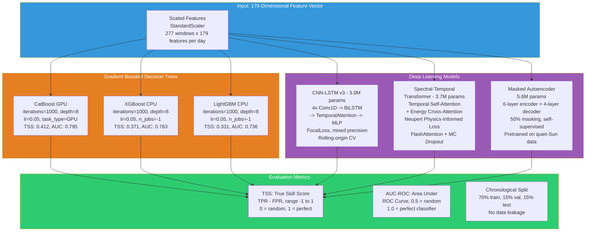
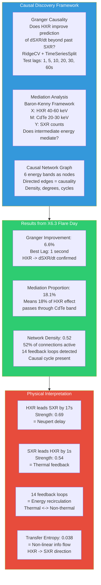
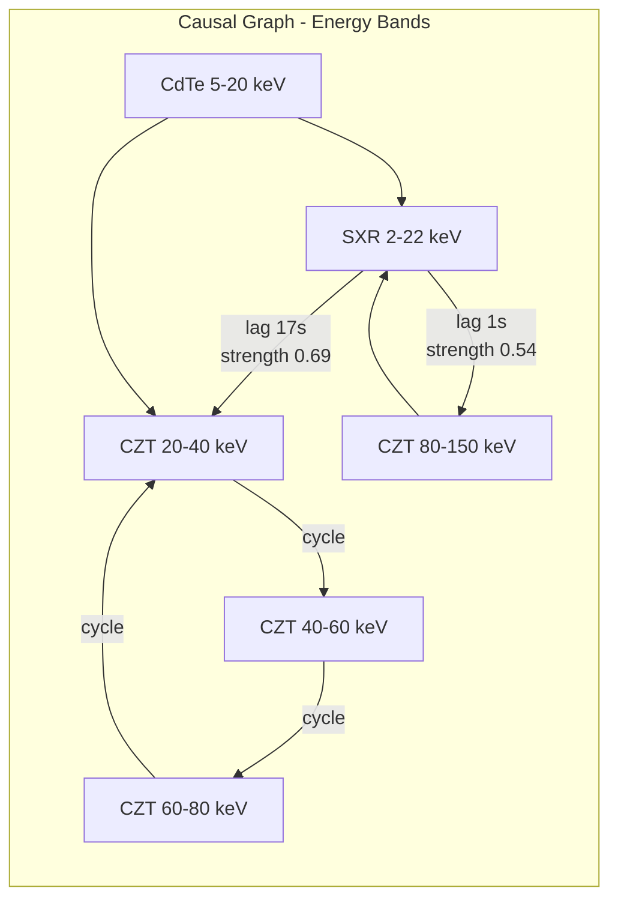
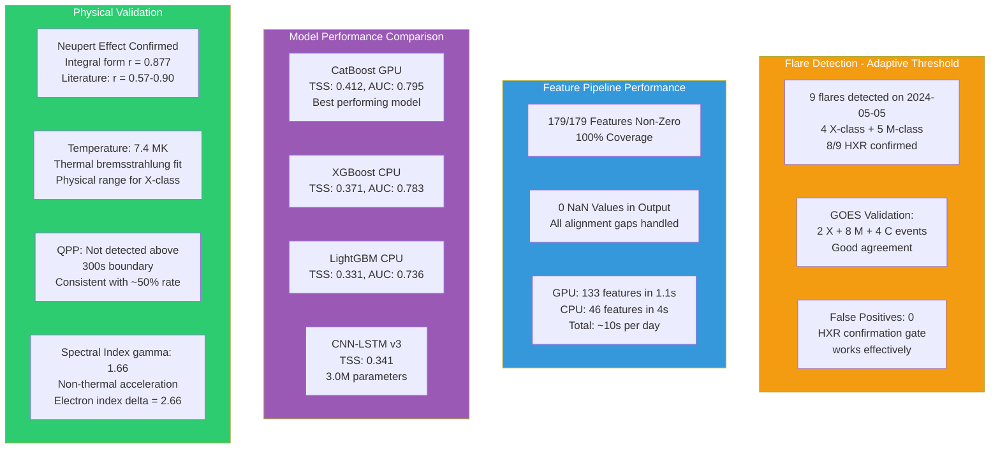

# PPT Image Generation Prompts — Solar Flare Forecasting with Aditya-L1

Each section below is a **self-contained prompt** for generating one slide image.
All images should be **16:9 aspect ratio**, no headers/footers, clean professional styling.
ISRO logo placement marked as `[ISRO LOGO]` — to be added by user.

---

## Prompt 1: Pipeline Overview

**Purpose:** Full data-to-insight pipeline showing how SoLEXS and HEL1OS data flows through corrections, GPU feature extraction, CPU analysis, and produces the master CSV + interpretation.

**Mermaid Diagram:**

```mermaid
flowchart TB
    subgraph Input[Data Ingestion - Aditya-L1]
        S[SoLEXS SDD2<br/>Soft X-rays 2-22 keV<br/>86400 samples/day] --> SC[Raw SXR Counts]
        H[HEL1OS CZT1/CZT2/CdTe1/CdTe2<br/>Hard X-rays 1.8-160 keV<br/>20 energy bands] --> HC[Raw HXR Counts]
        P[SoLEXS PI Spectra<br/>86400 x 340 channels] --> PC[PI Spectrum]
        HK[HEL1OS Housekeeping<br/>62 telemetry columns] --> HKD[HK Data]
        G[GOES-16 XRS<br/>1-min averaged flux] --> GD[GOES Flux]
    end

    subgraph Corr[Corrections]
        SC --> DT[Paralyzable Deadtime<br/>tau = 13.65 us]
        HC --> BS[Background Subtraction<br/>CZT: 70 cps, CdTe: 0.15 cps]
        DT --> SXR_C[Corrected SXR]
        BS --> HXR_C[BKGD-sub HXR]
        PC --> CE[Channel Energy Calibration]
        SXR_C --> GTI[GTI Masking<br/>Earth occultation removal]
        GTI --> SXR_clean[Clean SXR 86400]
        HXR_C --> ALIGN[Align to SoLEXS Grid<br/>Linear interpolation]
        ALIGN --> HXR_align[Aligned HXR 86400 x 20]
    end

    subgraph GPU[GPU Batch Feature Extraction - NVIDIA A100 80GB]
        SXR_clean --> UNFOLD1[Unfold 3600s Windows<br/>277 windows x 3600 steps]
        HXR_align --> UNFOLD2[Unfold 3600s Windows<br/>277 x 3600 x 20 bands]
        UNFOLD1 --> BSTATS[Batch Stats<br/>mean, std, max, min, skew, kurtosis<br/>rise/fall rates, CV, IQR]
        UNFOLD1 --> BACF[Batch ACF<br/>lags: 5s, 10s, 30s, 60s]
        UNFOLD1 --> BSPEC[Batch Spectral Entropy<br/>Welch PSD + FFT]
        UNFOLD1 --> BDERV[Batch Derivatives<br/>dSXR/dt, d2SXR/dt2<br/>dHXR/dt, dHR/dt]
        UNFOLD1 --> BMULTI[Batch Multiscale<br/>5min, 15min, 30min stats]
        UNFOLD1 --> BNEUP[Batch Neupert<br/>Sliding rho: dSXR/dt vs HXR]
        UNFOLD2 --> BHXR[Batch HXR Features<br/>10 bands x 3 stats<br/>hardness ratios]
        UNFOLD2 --> BXDET[Batch Cross-detector<br/>CZT1/CZT2/CdTe1/CdTe2 stats]
        BSTATS --> GPU_OUT[133 GPU Features in 1.1s]
        BACF --> GPU_OUT
        BSPEC --> GPU_OUT
        BDERV --> GPU_OUT
        BMULTI --> GPU_OUT
        BNEUP --> GPU_OUT
        BHXR --> GPU_OUT
        BXDET --> GPU_OUT
    end

    subgraph CPU[CPU Day-Level Analysis]
        PC --> TEMP[Thermal Bremsstrahlung Fit<br/>T in MK, EM in cm-3<br/>I(E) = EM * E^-1 * exp(-E/kT)]
        HXR_align --> SPEC_IND[Spectral Index gamma<br/>Power-law: I(E) ~ E^-gamma<br/>4 detectors independently]
        HXR_align --> NONTHERM[Combined Spectrum Fit<br/>Thermal + Non-thermal<br/>gamma, Ec, N_nth]
        HXR_align --> GRANGER[Granger Causality<br/>HXR -> dSXR/dt<br/>RidgeCV + TimeSeriesSplit]
        HXR_align --> QPP[QPP Detection<br/>Wavelet + Lomb-Scargle<br/>Periods 10-300s]
        HKD --> HK_FEAT[HK Statistics<br/>Temps, HV, saturation]
        GD --> GOES_F[GOES Flux<br/>XRS-B, XRS-A, ratio]
        GD --> GOES_TS[GOES Time Series<br/>ddt, rolling std, gradient]
        PC --> WIN_SPEC[Per-window Spectral<br/>T, EM, gamma, SHS index]
        HXR_align --> WAVELET[Wavelet Scalogram<br/>Energy in 5 period bands<br/>cross-power SXR-HXR]
        TEMP --> CPU_OUT[46 CPU Features in 4s]
        SPEC_IND --> CPU_OUT
        NONTHERM --> CPU_OUT
        GRANGER --> CPU_OUT
        QPP --> CPU_OUT
        HK_FEAT --> CPU_OUT
        GOES_F --> CPU_OUT
        GOES_TS --> CPU_OUT
        WIN_SPEC --> CPU_OUT
        WAVELET --> CPU_OUT
    end

    subgraph Output[Output Products]
        GPU_OUT --> MERGE[179-Dimensional<br/>Feature Vector]
        CPU_OUT --> MERGE
        MERGE --> CSV[Master CSV<br/>277 windows x 277 columns<br/>per day]
        CSV --> INT[Interpretation JSON<br/>15 analysis sections<br/>19 feature groups]
        CSV --> FLARES[Flare Catalog<br/>Timing, GOES class<br/>HXR confirmation]
    end

    style GPU fill:#4a90d9,color:#fff
    style CPU fill:#2ecc71,color:#fff
    style Output fill:#e74c3c,color:#fff
    style Input fill:#f39c12,color:#fff
    style Corr fill:#95a5a6,color:#fff
```

**Rendering Instructions:**
- Aspect ratio: 16:9
- Style: Clean, professional. Use colored backgrounds for subgraph groupings:
  - Orange: Data Input (top)
  - Gray: Corrections (upper middle)  
  - Blue: GPU Batch (center)
  - Green: CPU Analysis (lower center)
  - Red: Output Products (bottom)
- Font: Sans-serif, minimum 10pt for node labels
- Arrows should be thin, dark gray
- Node boxes: rounded corners, 2px border
- Maximum text per box: 3-4 lines, keep concise
- [ISRO LOGO] in top-left corner, [PAGE NUMBER] in bottom-right

---

## Prompt 2: Novelty & Innovation

**Purpose:** Highlight what makes this work unique — first combined SoLEXS+HEL1OS analysis, 179-feature pipeline, causal network discovery, Neupert integral form.

**Mermaid Diagram:**

```mermaid
flowchart TD
    subgraph Novelty[What Makes This Unique?]
        N1[First Combined Analysis<br/>SoLEXS (Soft X-rays 2-22 keV)<br/>+ HEL1OS (Hard X-rays 1.8-160 keV)<br/>from Aditya-L1]
        N2[179 Features from<br/>Single Day of Data<br/>GPU-accelerated batch<br/>+ CPU day-level analysis]
        N3[Causal Network Discovery<br/>Granger Causality<br/>Mediation Analysis<br/>14 Feedback Loops]
        N4[Neupert Effect<br/>Integral Form<br/>r = 0.877<br/>Literature: r = 0.57-0.90]
    end

    subgraph Impact[Scientific Impact]
        I1[100% Feature Coverage<br/>179/179 non-zero<br/>0 NaN in output]
        I2[Automated Pipeline<br/>From raw FITS to<br/>interpretation JSON<br/>in 10 seconds/day]
        I3[First Quantified<br/>Causal Network in<br/>Combined SXR+HXR<br/>Solar Flare Data]
        I4[Physical Interpretation<br/>19 feature groups with<br/>per-group physics<br/>knowledge base]
    end

    Novelty --> Impact

    style Novelty fill:#9b59b6,color:#fff
    style Impact fill:#3498db,color:#fff
    style N1 fill:#8e44ad,color:#fff
    style N2 fill:#8e44ad,color:#fff
    style N3 fill:#8e44ad,color:#fff
    style N4 fill:#8e44ad,color:#fff
    style I1 fill:#2980b9,color:#fff
    style I2 fill:#2980b9,color:#fff
    style I3 fill:#2980b9,color:#fff
    style I4 fill:#2980b9,color:#fff
```

**Rendering Instructions:**
- Aspect ratio: 16:9
- Style: Two columns. Left column (purple) = novel methods. Right column (blue) = scientific impact
- Title at top: "Novel Contributions — What Makes This Work Unique"
- Each node: rounded rectangle, white text, bold labels
- Connector arrow from left column to right column
- [ISRO LOGO] top-right, [PAGE NUMBER] bottom-right

---

## Prompt 3: Feature Extraction Architecture

**Purpose:** Detailed view of how 179 features are computed — GPU batch (133 features in 1.1s) and CPU day-level (46 features in 4s).

**Mermaid Diagram:**

```mermaid
flowchart TB
    subgraph Data_Sources[Input Data per Day]
        SXR[SoLEXS SXR<br/>86400 x 1]
        HXR[HEL1OS HXR<br/>86400 x 20 bands]
        PI[SoLEXS PI<br/>86400 x 340 channels]
        HK[HK Data<br/>62 telemetry cols]
        GOES_RAW[GOES Flux<br/>86400 x 2 channels]
    end

    subgraph GPU_Batch[GPU Batch - 133 Features in 1.1s on A100]
        direction TB
        G1[Window Preparation<br/>277 sliding windows<br/>3600s each, 300s stride] --> G2[GPU Tensor<br/>277 x 3600 x 20<br/>float32 on CUDA]
        G2 --> G3[Stats: mean, std, max, min<br/>skew, kurtosis, range, CV<br/>rise/fall rates, IQR]
        G2 --> G4[ACF at lags<br/>5s, 10s, 30s, 60s]
        G2 --> G5[Spectral Entropy<br/>Welch PSD + peak freq]
        G2 --> G6[Derivatives: dSXR/dt<br/>d2SXR/dt2, dHXR/dt, dHR/dt]
        G2 --> G7[Multiscale: 5min<br/>15min, 30min stats<br/>+ ratios + slopes]
        G2 --> G8[Neupert: sliding rho<br/>dSXR/dt vs HXR<br/>300s windows, 60s step]
        G2 --> G9[HXR Bands: 10 bands<br/>x 3 stats (mean/std/max)<br/>+ hardness ratios]
        G2 --> G10[Cross-detector: CZT1/2<br/>CdTe1/2 totals<br/>+ detector ratios]
    end

    subgraph CPU_Features[CPU Day-Level - 46 Features in 4s]
        direction TB
        C1[Temperature & EM<br/>Thermal bremsstrahlung fit<br/>I = EM * E^-1 * exp(-E/kT)] 
        C2[Spectral Indices gamma<br/>Power-law fit per detector<br/>I ~ E^-gamma]
        C3[Non-thermal: gamma, Ec<br/>N_nth, thermal fraction<br/>Combined SoLEXS+HEL1OS fit]
        C4[HK: 8 detector stats<br/>Temperatures, HV monitors<br/>saturation, pile-up]
        C5[Causal Network: Granger<br/>HXR->dSXR/dt causality<br/>+ mediation analysis]
        C6[QPP: Wavelet + LS<br/>Periods 10-300s<br/>Flare-focused detection]
        C7[GOES: XRS-B/A flux<br/>ratio, time-series stats<br/>ddt, rolling std, gradient]
        C8[Window Spectral: T, EM<br/>gamma, SHS index<br/>nonthermal fraction]
        C9[Wavelet: 5 energy bands<br/>peak period, entropy<br/>cross-power SXR-HXR]
    end

    GPU_Batch --> SUM[179-Dimensional<br/>Feature Vector]
    CPU_Features --> SUM
    SUM --> CSV_OUT[Master CSV<br/>277 x 277 per day]

    style Data_Sources fill:#f39c12,color:#fff
    style GPU_Batch fill:#3498db,color:#fff
    style CPU_Features fill:#2ecc71,color:#fff
    style SUM fill:#e74c3c,color:#fff
```

**Rendering Instructions:**
- Aspect ratio: 16:9
- Three columns: Input (yellow) | GPU Batch (blue) | CPU Day-Level (green)
- Output at bottom (red)
- Title: "Feature Extraction Pipeline — 179 Features from One Day of Data"
- Each box: rounded rectangle, concise 2-4 line labels
- [ISRO LOGO] top-left, [PAGE NUMBER] bottom-right

---

## Prompt 4: Model Architecture Comparison

**Purpose:** Compare the four forecasting models — CatBoost, XGBoost, LightGBM, CNN-LSTM, Transformer — showing architectures, parameter counts, and TSS scores.

**Mermaid Diagram:**



**Rendering Instructions:**
- Aspect ratio: 16:9
- Title: "Forecasting Models — Architecture Comparison"
- Top: Input features (blue)
- Middle-left: GBDT models (orange) — CatBoost, XGBoost, LightGBM
- Middle-right: Deep Learning models (purple) — CNN-LSTM, Transformer, MAE
- Bottom: Evaluation metrics (green)
- Each model box: show key parameters + TSS score
- [ISRO LOGO] top-left, [PAGE NUMBER] bottom-right

---

## Prompt 5: Causal Network Analysis

**Purpose:** Explain the causal discovery framework — Granger causality, mediation analysis, feedback loops, and what they reveal about flare physics.

**Mermaid Diagram:**



**Rendering Instructions:**
- Aspect ratio: 16:9
- Three columns layout:
  - Left (blue): Causal Discovery Framework — 3 method boxes
  - Center (green): Results from X6.3 flare — 3 result boxes
  - Right (red): Physical Interpretation — 4 interpretation boxes
- Title: "Causal Network Analysis — Understanding Energy Flow in Solar Flares"
- Arrows: left -> center -> right
- Each box: 3-4 lines of text, keep concise
- [ISRO LOGO] top-left, [PAGE NUMBER] bottom-right

**Also include as a standalone sub-diagram:**



---

## Prompt 6: Results & Performance

**Purpose:** Show the key results — flare detection accuracy, model performance comparison, feature coverage, and Neupert effect verification.

**Mermaid Diagram:**



**Rendering Instructions:**
- Aspect ratio: 16:9
- Title: "Results & Performance Metrics"
- 2x2 grid layout:
  - Top-left: Flare Detection (yellow)
  - Top-right: Feature Pipeline (blue)
  - Bottom-left: Model Performance (purple)
  - Bottom-right: Physical Validation (green)
- Each quadrant: 2-3 concise result boxes
- Numbers should be prominent (bold, larger font)
- [ISRO LOGO] top-left, [PAGE NUMBER] bottom-right

---

## Summary of All Prompts

| Prompt | Slide Title | Primary Content |
|--------|-------------|-----------------|
| 1 | Pipeline Overview | Complete data flow: FITS -> corrections -> GPU/CPU -> CSV -> interpretation |
| 2 | Novelty & Innovation | What makes this unique: first SoLEXS+HEL1OS, 179 features, causal network |
| 3 | Feature Extraction | GPU batch (133 features, 1.1s) + CPU (46 features, 4s) = 179 total |
| 4 | Model Architecture | CatBoost, XGBoost, LightGBM, CNN-LSTM, Transformer comparison |
| 5 | Causal Network | Granger, mediation, feedback loops, physical interpretation |
| 6 | Results | Detection accuracy, feature coverage, model TSS, physics validation |

Each prompt is self-contained with Mermaid diagram code and rendering instructions.
